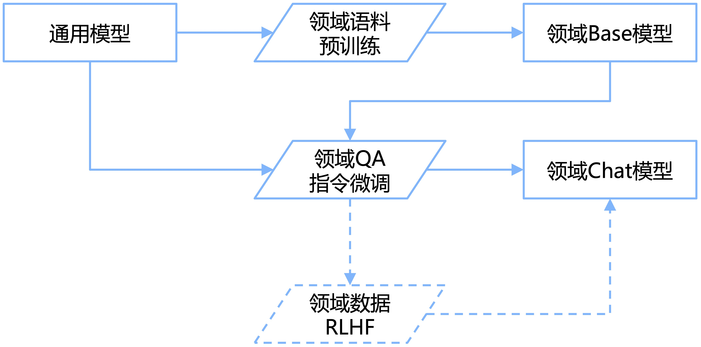

# Awesome Domain LLM

 
 

自以ChatGPT为代表的大语言模型出现以后，掀起了新一轮研究和应用浪潮，出现了许多包括LLaMA、ChatGLM、Baichuan、Qwen等在内的通用模型。
随后，来自不同领域的从业人员在通用模型的基础上通过持续预训练/指令微调将其应用于垂直领域。

    

本项目旨在收集和梳理垂直领域的**开源模型**、**数据集**及**评测基准**。
欢迎大家贡献本项目未收录的开源模型、数据集、评测基准等内容，一起推动大模型赋能各行各业！

## 🔔 更新
- [2023/11/01] 增加由蚂蚁集团联合北京大学发布的DevOps领域大模型[DevOps-Model](https://github.com/codefuse-ai/CodeFuse-DevOps-Model)和评测基准[DevOps-Eval](https://github.com/codefuse-ai/codefuse-devops-eval)。
- [2023/10/28] 增加金融大模型[DISC-FinLLM](https://github.com/FudanDISC/DISC-FinLLM)、医学大模型[AlpaCare](https://github.com/XZhang97666/AlpaCare)、海洋大模型[MarineGPT](https://github.com/hkust-vgd/MarineGPT)。
- [2023/10/19] 增加心理大模型[MentalLLaMA](https://github.com/SteveKGYang/MentalLLaMA)、双语生物医学大模型[Taiyi (太一)](https://github.com/DUTIR-BioNLP/Taiyi-LLM)、海洋大模型[OceanGPT](https://www.zjukg.org/project/OceanGPT/)。
- [2023/10/10] 增加由云智慧智能研究院和北航联合研发的面向运维领域的大模型[OWL](https://github.com/HC-Guo/Owl)和评测基准[OWL-Bench](https://github.com/HC-Guo/Owl#owl-bench)。增加中文法律大模型评测基准[LAiW](https://github.com/Dai-shen/LAiW)。
- [2023/10/05] 增加心理大模型[ChatPsychiatrist](https://github.com/EmoCareAI/ChatPsychiatrist)、金融大模型[InvestLM](https://github.com/AbaciNLP/InvestLM)、农业大模型[AgriGPT](https://github.com/AgriGPTs/AgriGPTs)和医疗大模型[WiNGPT2](https://github.com/winninghealth/WiNGPT2)。
- [2023/10/03] 增加两个法律评测基准，分别为面向中国法律体系的[LawBench](https://github.com/open-compass/LawBench)和美国法律体系的[LegalBench](https://github.com/HazyResearch/legalbench)。
- [2023/10/01] 增加[DISC-LawLLM](https://github.com/FudanDISC/DISC-LawLLM)，由复旦大学开源的旨在为用户提供专业、智能、全面的法律服务的法律领域大模型。增加[FinGLM](https://github.com/MetaGLM/FinGLM)，致力于构建一个开放的、公益的、持久的金融大模型项目，利用开源开放来促进「AI+金融」。
- [2023/9/25] 更新[Qwen](https://github.com/QwenLM/Qwen)，新增Qwen-14B和Qwen-14B-Chat模型，并更新Qwen-7B和Qwen-7B-Chat模型。相比原版Qwen-7B，新版使用更多训练数据 (2.4T token)，序列长度从2048扩展至8192。整体中文能力以及代码能力提升较多。
- [2023/9/22] 增加[InternLM(书生•浦语)](https://github.com/InternLM/InternLM)，上海AI实验室与商汤科技联合香港中文大学和复旦大学开源的多语基座模型。
- [2023/9/15] 增加[Zhongjing-LLaMA (仲景)](https://github.com/SupritYoung/Zhongjing)，包含预训练、有监督微调和RLHF完整训练流程的中文医学大模型。
- [2023/9/14] 增加[WeaverBird (织工鸟)](https://github.com/ant-research/fin_domain_llm)，可接入本地知识与网络搜索能力的金融领域对话大模型。
- [2023/9/13] 增加[夫子•明察](https://github.com/irlab-sdu/fuzi.mingcha)，由山东大学、浪潮云、中国政法大学联合研发的司法大模型。

## 📜 目录

- [🤖 模型](#-模型)
  - [🌐 通用模型](#-通用模型)
  - [🧩 领域模型](#-领域模型)
    - [🏥 医疗](#-医疗)
    - [⚖ 法律](#-法律)
    - [💰 金融](#-金融)
    - [🎓 教育](#-教育)
    - [➕ 其他](#-其他)
- [📚 数据集](#-数据集)
- [📏 评测基准](#-评测基准)
- [📎 附录](#-附录)
  - [✨ 点赞历史](#-点赞历史)
  - [🤝 友情链接](#-友情链接)

## 🤖 模型

### 🌐 通用模型

领域模型通常在通用模型的基础上进行持续预训练或指令微调得到，此处整理常用的开源通用模型。

| 模型                                                          | 大小                                           | 机构                                         | 论文   |
|:------------------------------------------------------------:|:----------------------------------------------:|:-------------------------------------------:|:-----:|
| [LLaMA2](https://github.com/facebookresearch/llama)          | 7B/7B-Chat   13B/13B-Chat   70B/70B-Chat | [Meta](https://ai.meta.com/)                | [paper](https://arxiv.org/abs/2307.09288)                             |
| [ChatGLM3-6B](https://github.com/THUDM/ChatGLM2-6B)          | 6B-Base/6B/6B-32K                              | [清华大学](https://github.com/THUDM/ChatGLM3)| [paper](https://arxiv.org/abs/2210.02414) 
| [Qwen](https://github.com/QwenLM/Qwen)                       | 7B/7B-Chat   14B/14B-Chat                   | [阿里云](https://qianwen.aliyun.com/)        | [paper](https://arxiv.org/abs/2309.16609)|
| [Baichuan2](https://github.com/baichuan-inc/Baichuan2)       | 7B/7B-Chat   13B/13B-Chat                   | [百川智能](https://www.baichuan-ai.com/home) | [paper](https://arxiv.org/abs/2309.10305)
| [InternLM](https://github.com/InternLM/InternLM)             | 7B/7B-Chat   20B/20B-Chat                   | [上海AI实验室](https://internlm.intern-ai.org.cn) | [paper](https://github.com/InternLM/InternLM-techreport/blob/main/InternLM.pdf)

### 🧩 领域模型

#### 🏥 医疗

- [AlpaCare](https://github.com/XZhang97666/AlpaCare)
  
  [[paper](https://arxiv.org/abs/2310.14558)]
  - 该项目开源了医学大模型AlpaCare，在LLaMA上微调得到。
    
- [Taiyi (太一)](https://github.com/DUTIR-BioNLP/Taiyi-LLM)
  
  - 该项目开源了中英双语生物医学大模型Taiyi (太一)，旨在探索大模型在生物医学领域中双语自然语言处理多任务的能力。

- [MentalLLaMA](https://github.com/SteveKGYang/MentalLLaMA)
  
  [[paper](https://arxiv.org/abs/2309.13567)]
  - 该项目开源了心理大模型MentalLLaMA，可以用于社交媒体上可解释的心理健康分析。

- [WiNGPT2](https://github.com/winninghealth/WiNGPT2)
  
  - WiNGPT是一个基于GPT的医疗垂直领域大模型，旨在将专业的医学知识、医疗信息、数据融会贯通，为医疗行业提供智能化的医疗问答、诊断支持和医学知识等信息服务，提高诊疗效率和医疗服务质量。
    
- [ChatPsychiatrist](https://github.com/EmoCareAI/ChatPsychiatrist)
  
  [[paper](https://arxiv.org/abs/2309.15461)]
  - 该项目开源了基于LLaMA-7B微调得到的心理大模型ChatPsychiatrist，该模型可以迅速识别心理问题，并提供量身定制的治疗建议。
    
- [Zhongjing-LLaMA (仲景)](https://github.com/SupritYoung/Zhongjing)
  
  [[paper](https://arxiv.org/abs/2308.03549)]
  - 该项目开源了首个包含预训练、有监督微调和 RLHF 完整训练流程的中文医学大模型，展现出了很好的泛化能力，在某些对话场景中甚至接近专业医生的专业水平。此外，还开源了一个包含 70,000 条完全来源于真实医患对话的多轮对话数据集。该数据集包含大量医生主动提问的语句，有助于提升模型的主动医疗询问能力。

- [DoctorGLM](https://github.com/xionghonglin/DoctorGLM)
  
  [[paper](https://arxiv.org/abs/2304.01097)]
  - 基于ChatGLM-6B的中文问诊模型，通过中文医疗对话数据集进行微调，实现了包括lora、p-tuningv2等微调及部署。

- [BenTsao (本草)](https://github.com/SCIR-HI/Huatuo-Llama-Med-Chinese)
  
  [[paper](https://arxiv.org/abs/2304.06975)]
  - 该项目开源了经过中文医学指令微调的大语言模型集，包括LLaMA、Alpaca-Chinese、Bloom、活字模型等。我们基于医学知识图谱以及医学文献，结合ChatGPT API构建了中文医学指令微调数据集，并以此对各种基模型进行了指令微调，提高了基模型在医疗领域的问答效果。
  
- [Med-ChatGLM](https://github.com/SCIR-HI/Med-ChatGLM)
  
  - 该项目开源了经过中文医学指令微调的ChatGLM-6B模型，微调数据与BenTsao相同。
    
- [BianQue (扁鹊)](https://github.com/scutcyr/BianQue)
  
  [[paper](https://arxiv.org/abs/2310.15896)]
  - 该项目开源了生活空间健康大模型。结合当前开源的中文医疗问答数据集（MedDialog-CN、IMCS-V2、CHIP-MDCFNPC、MedDG、cMedQA2、Chinese-medical-dialogue-data），分析其中的单轮/多轮特性以及医生问询特性，结合自建的生活空间健康对话大数据，构建了千万级别规模的扁鹊健康大数据BianQueCorpus，基于扁鹊健康大数据BianQueCorpus，选择ChatGLM-6B作为初始化模型，经过全量参数的指令微调训练得到BianQue。
    
- [HuatuoGPT (华佗)](https://github.com/FreedomIntelligence/HuatuoGPT)
  
  [[paper](https://arxiv.org/abs/2305.15075)]
  - 该项目开源了医疗大模型HuatuoGPT，包括基于Baichuan-7B训练得到的HuatuoGPT-7B和基于Ziya-LLaMA-13B-Pretrain-v1训练得到的HuatuoGPT-13B。

- [QiZhenGPT](https://github.com/CMKRG/QiZhenGPT)
  
  - 该项目利用启真医学知识库构建的中文医学指令数据集，并基于此在Chinese-LLaMA-Plus-7B、CaMA-13B、ChatGLM-6B模型上进行指令精调，大幅提高了模型在中文医疗场景下效果。

- [ChatMed](https://github.com/michael-wzhu/ChatMed)
  
  - 该项目开源了中文医疗大模型ChatMed-Consult，以中文医疗在线问诊数据集ChatMed_Consult_Dataset的50w+在线问诊+ChatGPT回复作为训练集，基于LlaMA-7b采用LoRA微调得到。

- [ShenNong-TCM-LLM (神农)](https://github.com/michael-wzhu/ShenNong-TCM-LLM)
  
  - 该项目开源了中文中医药大模型ShenNong-TCM-LLM，以开源的中医药知识图谱为基础，采用以实体为中心的自指令方法，调用ChatGPT得到2.6w+中医药指令数据集ChatMed_TCM_Dataset，基于该数据集以LlaMA为底座，采用LoRA微调得到。

- [XrayGLM](https://github.com/WangRongsheng/XrayGLM)
  
  - 该项目开源了中文多模态医学数据集及模型，其在医学影像诊断和多轮交互对话上显示出了非凡的潜力。

- [MedicalGPT](https://github.com/shibing624/MedicalGPT)
  
  - 该项目开源了医疗大模型MedicalGPT，实现了包括增量预训练、有监督微调、RLHF(奖励建模、强化学习训练)和DPO(直接偏好优化)。

- [Sunsimiao (孙思邈)](https://github.com/thomas-yanxin/Sunsimiao)
  
  - 该项目开源了中文医疗大模型Sunsimiao，该模型基于baichuan-7B和ChatGLM-6B底座模型在十万级高质量的中文医疗数据中微调而得。

- [CareGPT](https://github.com/WangRongsheng/CareGPT)
  
  - 该项目开源了医疗大模型CareGPT (关怀GPT)，同时它集合了数十个公开可用的医疗微调数据集和开放可用的医疗大语言模型，包含LLM的训练、测评、部署等以促进医疗LLM快速发展。

- [DISC-MedLLM](https://github.com/FudanDISC/DISC-MedLLM)
  
  [[paper](https://arxiv.org/abs/2308.14346)]
  - 该项目是由复旦大学发布的针对医疗健康对话式场景而设计的医疗领域大模型与数据集，该模型由DISC-Med-SFT数据集基于Baichuan-13B-Base指令微调得到，有效地对齐了医疗场景下的人类偏好，弥合了通用语言模型输出与真实世界医疗对话之间的差距。

- [PMC-LLaMA](https://github.com/chaoyi-wu/PMC-LLaMA)
  
  [[paper](https://arxiv.org/abs/2304.14454)]
  - 该项目开源了医疗大模型PMC-LLaMA，包括预训练版本的MedLLaMA_13B和指令微调版本的PMC_LLaMA_13B。

- [ChatDoctor](https://github.com/Kent0n-Li/ChatDoctor)
  
  [[paper](https://arxiv.org/abs/2303.14070)]
  - 该项目开源了医疗大模型ChatDoctor，在LLaMA的基础上训练得到。

- [MING (明医)](https://github.com/189569400/MedicalGPT-zh)
  
  - 该项目开源了医疗大模型MING，基于bloomz-7b指令微调得到MING-7B，支持医疗问答、智能问诊等功能。

- [IvyGPT](https://github.com/WangRongsheng/IvyGPT)
  
  - 该项目开源了医疗大模型IvyGPT，它在高质量的医学问答数据上进行了监督微调，并使用人类反馈的强化学习进行了训练。

- [PULSE](https://github.com/openmedlab/PULSE)
  
  - 该项目开源了中文医疗大模型PULSE，该模型使用约4,000,000个中文医学领域和通用领域的指令微调数据进行微调，支持医学领域的各种自然语言处理任务，包括健康教育、医师考试问题、报告解读、医疗记录结构化以及模拟诊断和治疗。

- [HuangDI (皇帝)](https://github.com/Zlasejd/HuangDI)
  
  - 该项目开源了中医大模型HuangDI (皇帝)，该模型首先在Ziya-LLaMA-13B-V1基座模型的基础上加入中医教材、中医各类网站数据等语料库，训练出一个具有中医知识理解力的预训练模型，之后在此基础上通过海量的中医古籍指令对话数据及通用指令数据进行有监督微调，使得模型具备中医古籍知识问答能力。
 
- [ZhongJing (仲景)](https://github.com/pariskang/CMLM-ZhongJing)
  
  - 该项目开源了中医大模型ZhongJing (仲景)，该模型旨在阐明中医博大精深之知识，传承古代智慧与现代技术创新，最终为医学领域提供可信赖和专业的工具。

- [TCMLLM](https://github.com/2020MEAI/TCMLLM)
  
  - 该项目拟通过大模型方式实现中医临床辅助诊疗（病证诊断、处方推荐等）中医药知识问答等任务，推动中医知识问答、临床辅助诊疗等领域的快速发展。目前针对中医临床智能诊疗问题中的处方推荐任务，发布了中医处方推荐大模型TCMLLM-PR，通过整合真实世界临床病历、医学典籍与中医教科书等数据，构建了包含68k数据条目的处方推荐指令微调数据集，在ChatGLM大模型上进行微调得到。

- [MeChat](https://github.com/qiuhuachuan/smile)
  
  [[paper](https://arxiv.org/abs/2305.00450)]
  - 该项目开源了中文心理健康支持对话大模型与数据集。模型由ChatGLM-6B LoRA 16-bit指令微调得到。数据集通过ChatGPT改写真实的心理互助QA为多轮的心理健康支持多轮对话，该数据集含有56k个多轮对话，其对话主题、词汇和篇章语义更加丰富多样，更加符合在长程多轮对话的应用场景。
  
- [SoulChat (灵心)](https://github.com/scutcyr/SoulChat)
  
  [[paper](https://arxiv.org/abs/2311.00273)]
  - 该项目开源了心理健康大模型SoulChat (灵心)，该模型以ChatGLM-6B作为初始化模型，经过百万规模心理咨询领域中文长文本指令与多轮共情对话数据联合指令微调得到。

- [MindChat (漫谈)](https://github.com/X-D-Lab/MindChat)
  
  - 该项目开源了心理大模型MindChat (漫谈)，该模型采用了经过人工清洗的约20万条的高质量多轮心理对话数据进行训练，涵盖工作、家庭、学习、生活、社交、安全等多个方面，期望从心理咨询、心理评估、心理诊断、心理治疗四个维度帮助人们纾解心理压力与解决心理困惑, 提高心理健康水平。

- [QiaoBan (巧板)](https://github.com/HIT-SCIR-SC/QiaoBan)
  
  - 该项目开源了儿童情感对话大模型QiaoBan，基于开源通用大模型，使用通用域人机对话、单轮指令数据以及儿童情感陪伴对话数据进行指令微调，研发出适用于儿童情感陪伴的大模型。

#### ⚖ 法律

- [DISC-LawLLM](https://github.com/FudanDISC/DISC-LawLLM)
  
  [[paper](https://arxiv.org/abs/2309.11325)]
  - DISC-LawLLM 是一个旨在为用户提供专业、智能、全面的法律服务的法律领域大模型，由复旦大学数据智能与社会计算实验室 (Fudan-DISC) 开发并开源，包括 DISC-LawLLM-13B 模型 和 DISC-Law-SFT 数据集。

- [LawGPT_zh (獬豸)](https://github.com/LiuHC0428/LAW-GPT)
  
  - 本项目开源的中文法律通用模型由ChatGLM-6B LoRA 16-bit指令微调得到。数据集包括现有的法律问答数据集和基于法条和真实案例指导的self-Instruct构建的高质量法律文本问答，提高了通用语言大模型在法律领域的表现，提高了模型回答的可靠性和专业程度。
    
- [LaWGPT](https://github.com/pengxiao-song/LaWGPT)
  
  - 该系列模型在通用中文基座模型（如Chinese-LLaMA、ChatGLM等）的基础上扩充法律领域专有词表、大规模中文法律语料预训练，增强了大模型在法律领域的基础语义理解能力。在此基础上，构造法律领域对话问答数据集、中国司法考试数据集进行指令精调，提升了模型对法律内容的理解和执行能力。

- [LexiLaw](https://github.com/CSHaitao/LexiLaw)
  
  - LexiLaw是一个经过微调的中文法律大模型，它基于ChatGLM-6B架构，通过在法律领域的数据集上进行微调，使其在提供法律咨询和支持方面具备更高的性能和专业性。该模型旨在为法律从业者、学生和普通用户提供准确、可靠的法律咨询服务。无论是需要针对具体法律问题的咨询，还是对法律条款、案例解析、法规解读等方面的查询，LexiLaw都能够提供有益的建议和指导。

- [Lawyer LLaMA](https://github.com/AndrewZhe/lawyer-llama)
  
  [[paper](https://arxiv.org/abs/2305.15062)]
  - 该项目开源了法律领域的指令微调数据和基于LLaMA训练的中文法律大模型Lawyer LLaMA。Lawyer LLaMA首先在大规模法律语料上进行了预训练，让它系统的学习中国的法律知识体系。在此基础上，借助ChatGPT收集了一批对中国国家统一法律职业资格考试客观题的分析和对法律咨询的回答，利用收集到的数据对模型进行指令微调，让模型习得将法律知识应用到具体场景中的能力。

- [HanFei (韩非)](https://github.com/siat-nlp/HanFei)
  
  - HanFei-1.0(韩非)是国内首个全参数训练的法律大模型，参数量7b，主要功能包括：法律问答、多轮对话、撰写文章、检索等。

- [ChatLaw](https://github.com/PKU-YuanGroup/ChatLaw)
  
  [[paper](https://arxiv.org/abs/2306.16092)]
  - 由北大开源的一系列法律大模型，使用大量法律新闻、法律论坛、法条、司法解释、法律咨询、法考题、判决文书等原始文本来构造对话数据，包括基于姜子牙-13B、Anima-33B训练而来的ChatLaw-13B和ChatLaw-33B。此外，还开源了ChatLaw-Text2Vec，使用93w条判决案例做成的数据集基于BERT训练了一个相似度匹配模型，可将用户提问信息和对应的法条相匹配。

- [Lychee (律知)](https://github.com/davidpig/lychee_law)
  
  - 开源了中文司法领域大模型Law-GLM-10B，基于GLM-10B模型，在30GB中文法律数据上进行指令微调得到。

- [wisdomInterrogatory (智海-录问)](https://github.com/zhihaiLLM/wisdomInterrogatory)
  
  - 由浙江大学、阿里巴巴达摩院以及华院计算三家单位共同设计研发的法律大模型，基于Baichuan-7B进行了法律领域数据的二次预训练与指令微调，并设计了知识增强的推理流程。

- [JurisLMs](https://github.com/seudl/JurisLMs)
  
  - 该项目基于中文法学语料训练了一系列语言模型，包括: 1) 可解释法律判决预测模型AI Judge，由GPT2在法学语料上进一步预训练之后，结合一个法条适用模型（一个基于BERT的分类器）微调得到，不仅能够给出判决结果，还能给出相应的法院观点; 2) 智能法律咨询模型AI Lawyer，采用主动学习在少量数据上进行微调得到，可以根据用户咨询适用正确的法律法规回答问题。

- [夫子•明察](https://github.com/irlab-sdu/fuzi.mingcha)
  
  - 夫子•明察司法大模型是由山东大学、浪潮云、中国政法大学联合研发，以 ChatGLM 为大模型底座，基于海量中文无监督司法语料（包括各类判决文书、法律法规等）与有监督司法微调数据（包括法律问答、类案检索）训练的中文司法大模型。该模型支持法条检索、案例分析、三段论推理判决以及司法对话等功能，旨在为用户提供全方位、高精准的法律咨询与解答服务。

#### 💰 金融

- [DISC-FinLLM](https://github.com/FudanDISC/DISC-FinLLM)
  
  [[paper](https://arxiv.org/abs/2310.15205)]
  - DISC-FinLLM是一个金融领域的大语言模型，是由面向不同金融场景的4个模组：金融咨询、金融文本分析、金融计算、金融知识检索问答构成的多专家智慧金融系统。这些模组分别在金融NLP任务、人类试题、资料分析和时事分析等四个评测中展现出明显优势，证明了DISC-FinLLM能为广泛的金融领域提供强有力的支持。

- [InvestLM](https://github.com/AbaciNLP/InvestLM)
  
  [[paper](https://arxiv.org/abs/2309.13064)]
  - 该项目开源了基于LLaMA-65B微调得到的英文金融大模型。
    
- [FinGLM](https://github.com/MetaGLM/FinGLM)
  
  - 致力于构建一个开放的、公益的、持久的金融大模型项目，利用开源开放来促进「AI+金融」。

- [WeaverBird (织工鸟)](https://github.com/ant-research/fin_domain_llm)
  
  [[paper](https://arxiv.org/abs/2308.05361)]
  - 该项目开源了基于中英双语金融领域语料库微调的，同时可接入本地知识库以及网络搜索引擎的金融领域对话大模型。
  
- [BBT-FinCUGE-Applications](https://github.com/ssymmetry/BBT-FinCUGE-Applications)
  
  [[paper](https://arxiv.org/abs/2302.09432)]
  - 该项目开源了中文金融领域语料库BBT-FinCorpus，知识增强型大模型BBT-FinT5及评测基准CFLEB。

- [Cornucopia (聚宝盆)](https://github.com/jerry1993-tech/Cornucopia-LLaMA-Fin-Chinese)
  
  - 该项目基于公开和爬取的中文金融领域问答数据构建指令数据集，并在此基础上对LLaMA系模型进行了指令微调，提高了LLaMA在金融领域的问答效果。

- [XuanYuan (轩辕)](https://github.com/Duxiaoman-DI/XuanYuan)
  
  [[paper](https://arxiv.org/abs/2305.12002)]
  - 轩辕是国内首个开源的千亿级中文对话大模型，同时也是首个针对中文金融领域优化的千亿级开源对话大模型。轩辕在BLOOM-176B的基础上针对中文通用领域和金融领域进行了针对性的预训练与微调，它不仅可以应对通用领域的问题，也可以解答与金融相关的各类问题，为用户提供准确、全面的金融信息和建议。

- [PIXIU (貔貅)](https://github.com/chancefocus/PIXIU)
  
  [[paper](https://arxiv.org/abs/2306.05443)]
  - 该项目开源了金融领域指令微调数据集FIT，大模型FinMA及评测基准FLARE。

- [FinGPT](https://github.com/AI4Finance-Foundation/FinGPT)
  
  [[paper1](https://arxiv.org/abs/2306.06031)]
  [[paper2](https://arxiv.org/abs/2310.04793)]
  - 该项目开源了多个金融大模型，包括ChatGLM2-6B+LoRA和LLaMA2-7B+LoRA等金融大模型，收集了包括金融新闻、社交媒体、财报等中英文训练数据。
 
- [FLANG](https://github.com/SALT-NLP/FLANG)
  
  [[paper](https://arxiv.org/abs/2211.00083)]
  - 该项目开源了金融大模型FLANG和评测基准FLUE。

#### 🎓 教育

- [桃李 (Taoli)](https://github.com/blcuicall/taoli)
  
  - 该项目开源了适用于国际中文教育领域的大模型，基于目前国际中文教育领域流通的500余册国际中文教育教材与教辅书、汉语水平考试试题以及汉语学习者词典等，构建了国际中文教育资源库。通过多种形式的指令构造了共计88000条的高质量国际中文教育问答数据集，并利用收集到的数据对模型进行指令微调，让模型习得将国际中文教育知识应用到具体场景中的能力。

- [EduChat](https://github.com/icalk-nlp/EduChat)
  
  [[paper](https://arxiv.org/abs/2308.02773)]
  - 该项目开源了针对教育垂直领域的对话大模型，主要研究以预训练大模型为基底的教育对话大模型相关技术，融合多样化的教育垂直领域数据，辅以指令微调、价值观对齐等方法，提供教育场景下自动出题、作业批改、情感支持、课程辅导、高考咨询等丰富功能，服务于广大老师、学生和家长群体，助力实现因材施教、公平公正、富有温度的智能教育。

#### ➕ 其他

- [DevOps-Model](https://github.com/codefuse-ai/CodeFuse-DevOps-Model)
  
   
  - 该项目开源了由蚂蚁集团联合北京大学研发的DevOps领域大模型DevOps-Model。

- [MarineGPT](https://github.com/hkust-vgd/MarineGPT)
  [[paper](https://arxiv.org/abs/2310.13596)]
   
  - 该项目开源了首个专为海洋领域设计的视觉语言模型MarineGPT。
    
- [OceanGPT]((https://www.zjukg.org/project/OceanGPT))
  [[paper](https://arxiv.org/abs/2310.02031)]
   
  - 该项目开源了面向海洋学的大模型OceanGPT。

- [OWL](https://github.com/HC-Guo/Owl)
  
  [[paper](https://arxiv.org/abs/2309.09298)]
   
  - 该项目开源了由云智慧智能研究院和北航联合研发的智能运维（AIOps）大语言模型，其在收集的 Owl-Instruct 数据基础上训练而成。此外，由于缺乏智能运维领域的大语言模型的 Benchmark，还建立了 Owl-Bench 评测基准。
    
- [AgriGPT](https://github.com/AgriGPTs/AgriGPTs)
  
   
  - 该项目开源了农业大模型MediaGPT。

- [MediaGPT](https://github.com/IMOSR/MediaGPT)
  
   
  - 该项目开源了中文自媒体大模型MediaGPT，首先在大规模自媒体语料上进行连续预训练，系统地学习自媒体的知识体系。然后，借助ChatGPT收集了一批关于抖音运营、短视频创作、巨量千川投放、直播运营和直播话术技巧等领域知识问题的分析和回答，并利用这些数据对模型进行指令微调，使模型习得如何将自媒体知识应用到实际场景中。

- [EcomGPT](https://github.com/Alibaba-NLP/EcomGPT)
  
  [[paper](https://arxiv.org/abs/2308.06966)]
   
  - 该项目开源了电商大模型EcomGPT，基于BLOOMZ在电商领域指令微调数据集EcomInstruct进行微调，在12个电商评测数据集上的人工评估超过ChatGPT。

- [StarWhisper (星语)](https://github.com/Yu-Yang-Li/StarWhisper)
  
   
  - 在天文科学教育联盟、集思谱文献平台、司天工程的支持下，基于天文大模型StarGLM开发经验，我们进一步训练了星语StarWhisper系列模型(包括6B,7B,13B,14B,20B)。以进一步缓解大模型在天文通用知识的幻觉现象，为接下来可处理天文多模态任务、部署于望远镜阵列的科学具身智能——司天大脑打下基础。

- [K2](https://github.com/davendw49/k2)
  
  [[paper](https://arxiv.org/abs/2306.05064)]
   
  - 该项目开源了地球科学大模型K2，该模型在LLaMA的基础上使用地球科学文献和维基百科数据进行预训练，然后使用GeoSignal数据集进行指令微调。

- [TransGPT (致远)](https://github.com/DUOMO/TransGPT)
  
   
  - 该项目开源了交通大模型TransGPT (致远)，主要致力于在真实交通行业中发挥实际价值。它能够实现交通情况预测、智能咨询助手、公共交通服务、交通规划设计、交通安全教育、协助管理、交通事故报告和分析、自动驾驶辅助系统等功能。TransGPT作为一个通用常识交通大模型，可以为道路工程、桥梁工程、隧道工程、公路运输、水路运输、城市公共交通运输、交通运输经济、交通运输安全等行业提供通识常识。以此为基础，可以落脚到特定的交通应用场景中。

- [AutoAudit](https://github.com/ddzipp/AutoAudit)
  
   
  - 该项目开源了网络安全大模型AutoAudit，其目标是为安全审计和网络防御提供强大的自然语言处理能力。它具备分析恶意代码、检测网络攻击、预测安全漏洞等功能，为安全专业人员提供有力的支持。

- [TechGPT](https://github.com/neukg/TechGPT)
  
   
  - 该项目开源了科技大模型TechGPT，该模型面向计算机科学、材料、机械、冶金、金融和航空航天等十余种垂直专业领域，涵盖了领域术语抽取、命名实体识别、关系三元组抽取、文本关键词生成、标题生成摘要、摘要生成标题、文本领域识别、机器阅读理解、基础常识问答、基于上下文的知识问答、建议咨询类问答、文案生成、中英互译和简单代码生成等多项自然语言理解和生成能力。

- [Mozi (墨子)](https://github.com/gmftbyGMFTBY/science-llm)
  
  [[paper](https://github.com/gmftbyGMFTBY/science-llm/blob/main/asset/mozi_technical_report.pdf)]
   
  - 该项目开源了科技论文大模型Mozi (墨子)，可以用于科技文献的问答和情感支持。

- [OpenBioMed](https://github.com/PharMolix/OpenBioMed)
  
  [[paper1](https://arxiv.org/abs/2308.09442)]
  [[paper2](https://arxiv.org/abs/2307.09484)]
  [[paper3](https://arxiv.org/abs/2306.04371)]
   
  - 该项目开源了若干多模态生物医学大模型，包括多模态生物医药大模型BioMedGPT、多模态小分子基础模型DrugFM和MolFM、细胞表示学习模型CellLM等。

- [YaYi (雅意)](https://github.com/wenge-research/YaYi)
  
   
  - 该项目开源了多领域大模型YaYi (雅意)，该模型在百万级人工构造的高质量领域数据上进行指令微调得到，训练数据覆盖媒体宣传、舆情分析、公共安全、金融风控、城市治理等五大领域，上百种自然语言指令任务。

## 📚 数据集

## 📏 评测基准

- [C-Eval](https://github.com/SJTU-LIT/ceval)
  
  [[paper](https://arxiv.org/abs/2305.08322)]
   
  - C-Eval是一个由上海交通大学发布的中文基础模型评测基准，包含了13948个多项选择题，涵盖了人文，社科，理工，其他专业四个大方向，52个学科，从中学到大学研究生以及职业考试。

- [AGIEval](https://github.com/ruixiangcui/AGIEval)
  
  [[paper](https://arxiv.org/abs/2304.06364)]
   
  - AGIEval是一个由微软发布的评测基准，用于评估大模型在人类认知任务中的表现，包含了20个面向普通考生的官方、公开、高标准入学和资格考试，包括普通大学入学考试 (中国高考和美国SAT考试)、法学院入学考试、数学竞赛和律师资格考试、国家公务员考试等。

- [Xiezhi (獬豸)](https://github.com/mikegu721/xiezhibenchmark)
  
  [[paper](https://arxiv.org/abs/2306.05783)]
   
  - Xiezhi是一个由复旦大学发布的综合的、多学科的、能够自动更新的领域知识评测基准，包含了哲学、经济学、法学、教育学、文学、历史学、自然科学、工学、农学、医学、军事学、管理学、艺术学这13个学科门类，516个具体学科，249587道题目。

- [CMMLU](https://github.com/haonan-li/CMMLU)
  
  [[paper](https://arxiv.org/abs/2306.09212)]
   
  - CMMLU是一个综合性的中文评测基准，专门用于评估语言模型在中文语境下的知识和推理能力。CMMLU涵盖了从基础学科到高级专业水平的67个主题。它包括：需要计算和推理的自然科学，需要知识的人文科学和社会科学,以及需要生活常识的中国驾驶规则等。此外，CMMLU中的许多任务具有中国特定的答案，可能在其他地区或语言中并不普遍适用。因此是一个完全中国化的中文测试基准。

- [MMCU](https://github.com/Felixgithub2017/MMCU)
  
  [[paper](https://arxiv.org/abs/2304.12986)]
   
  - MMCU是一个综合性的中文评测基准，包括来自医学、法律、心理学和教育等四大领域的测试。

- [CG-Eval](https://github.com/Felixgithub2017/CG-Eval)
  
  [[paper](https://arxiv.org/abs/2308.04823)]
   
  - CG-Eval是一个由甲骨易AI研究院与LanguageX AI Lab联合发布的针对中文大模型生成能力的评测基准。包含了科技与工程、人文与社会科学、数学计算、医师资格考试、司法考试、注册会计师考试等六个大科目类别下的55个子科目的11000道不同类型问题。CG-Eval包含一套复合的打分系统：对于非计算题，每一道名词解释题和简答题都有标准参考答案，采用多个标准打分然后加权求和；对于计算题目，会提取最终计算结果和解题过程，然后综合打分。

- [CBLUE](https://github.com/CBLUEbenchmark/CBLUE)
  
  [[paper](https://arxiv.org/abs/2106.08087)]
   
  - CBLUE是一个中文医学语言理解评测基准，包含8个中文医疗语言理解任务。
    
- [PromptCBLUE](https://github.com/michael-wzhu/PromptCBLUE)
  
  [[paper](https://arxiv.org/abs/2310.14151)]
   
  - PromptCBLUE是一个面向中文医疗场景的评测基准，通过对CBLUE基准进行二次开发，将16种不同的医疗场景NLP任务全部转化为基于提示的语言生成任务。

- [LAiW](https://github.com/Dai-shen/LAiW)
  
  [[paper](https://arxiv.org/abs/2310.05620)]
   
  - LAiW 是一个中文法律大模型评测基准，针对3大能力设计13个基础任务：1）法律 NLP 基础能力：评测法律基础任务、 NLP 基础任务和法律信息抽取的能力，包括法条推送、要素识别、命名实体识别、司法要点摘要和案件识别 5 个基础任务；2）法律基础应用能力：评测大模型对法律领域知识的基础应用能力，包括争议焦点挖掘、类案匹配、刑事裁判预测、民事裁判预测和法律问答 5 个基础任务；3）法律复杂应用能力：评测大模型对法律领域知识的复杂应用能力，包括司法说理生成、案情理解和法律咨询 3 个基础任务。

- [LawBench](https://github.com/open-compass/LawBench)
  
  [[paper](https://arxiv.org/abs/2309.16289)]
   
  - LawBench 是一个面向中国法律体系的法律评测基准。LawBench 模拟了司法认知的三个维度，并选择了20个任务来评估大模型的能力。与一些仅有多项选择题的现有基准相比，LawBench 包含了更多与现实世界应用密切相关的任务类型，如法律实体识别、阅读理解、犯罪金额计算和咨询等。

- [LegalBench](https://github.com/HazyResearch/legalbench)
  
  [[paper](https://arxiv.org/abs/2308.11462)]
   
  - LegalBench 是一个面向美国法律体系的法律评测基准，包含162个法律推理任务。
    
- [LEXTREME](https://github.com/JoelNiklaus/LEXTREME)
  
  [[paper](https://arxiv.org/abs/2301.13126)]
   
  - LEXTREME是一个多语言的法律评测基准，包含了24种语言11个评测数据集。

- [LexGLUE](https://github.com/coastalcph/lex-glue)
  
  [[paper](https://arxiv.org/abs/2110.00976)]
   
  - LexGLUE是一个英文法律评测基准。
    
- [FinEval](https://github.com/SUFE-AIFLM-Lab/FinEval)
  
  [[paper](https://arxiv.org/abs/2308.09975)]
   
  - FinEval是一个金融知识评测基准，包含了4,661个高质量的多项选择题，涵盖金融、经济、会计和证书等领域，34个不同的学术科目。

- [FLARE](https://github.com/chancefocus/PIXIU)
  
  [[paper](https://arxiv.org/abs/2306.05443)]
   
  - FLARE是一个金融评测基准，包含了金融知识理解和预测等任务。

- [CFLEB](https://github.com/ssymmetry/BBT-FinCUGE-Applications)
  
  [[paper](https://arxiv.org/abs/2302.09432)]
   
  - CFLEB是一个中文金融评测基准，包含两项语言生成任务和四项语言理解任务。

- [FLUE](https://github.com/SALT-NLP/FLANG)
  
  [[paper](https://arxiv.org/abs/2211.00083)]
  
  - FLUE是一个金融评测基准，包含5个金融领域数据集。
  
- [GeoGLUE](https://modelscope.cn/datasets/damo/GeoGLUE/summary)
  [[paper](https://arxiv.org/abs/2305.06545)]
   
  - GeoGLUE是一个由阿里巴巴达摩院与高德联合发布的地理语义理解能力评测基准，旨在推动地理相关文本处理技术和社区的发展。本榜单提炼了其中多个典型场景：地图搜索、电商物流、政府登记、金融交通，并设计了六个核心任务：门址地址要素解析、地理实体对齐、Query-POI库召回、Query-POI相关性排序、地址Query成分分析、WhereWhat切分。

- [OWL-Bench](https://github.com/HC-Guo/Owl)
  
  [[paper](https://arxiv.org/abs/2309.09298)]
   
  - OWL-Bench 是一个面向运维领域的双语评测基准。它包含 317 个问答题和 1000 个多选题，涵盖了该领域的众多现实工业场景，包括信息安全、应用、系统架构、软件架构、中间件、网络、操作系统、基础设施和数据库这九个不同的子领域。以确保 OWL-Bench 能够展现出多样性。

- [DevOps-Eval](https://github.com/codefuse-ai/codefuse-devops-eval)
  
   
  - DevOps-Eval是由蚂蚁集团联合北京大学发布的面向DevOps领域的大语言模型评测基准。

## 📎 附录

### ✨ 点赞历史

### 🤝 友情链接
- [Awesome AIGC Tutorials](https://github.com/luban-agi/Awesome-AIGC-Tutorials)
  - 该项目收集了关于AIGC的各种精选教程和资源，既适合初学者也适合进阶AI爱好者。 
- [Awesome Tool Learning](https://github.com/luban-agi/Awesome-Tool-Learning)
  - 该项目收集了关于工具学习的资源，包括论文、框架和应用。
- [Awesome LLM reasoning](https://github.com/luban-agi/Awesome-LLM-reasoning)
  - 该项目收集了关于大语言模型推理方面的资源，包括论文、数据集等。
